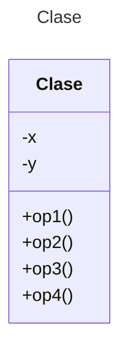

# Proyecto (Maven) - Strategy

## REQUISITOS-MINIPUNTO DE VENTA

***Mi Tiendita*** ofrece el siguiente catálogo de productos de abarrote a sus clientes:

|CLAVE|PRODUCTO    | PRECIO UNITARIO|
|-----|-----------|----------------|
|1|Leche      | $15.50 lt|
|2|Crema      | $10.00 kg|
|3|Mantequilla| $4.50 kg|
|4|Jamón|$35.00 kg|
|5|Queso|$100.00 kg|
|6|Plátano|$14.00 kg|
|7|Manzana| $13.00 kg|

Se desea crear una aplicación que calcule el total de cualquier venta en base a la siguiente política de cobro:

**Total Venta = Suma (Precio Unitario * Unidades) – Descuento (antes de impuestos) + Impuesto (IVA 16%) sobre (Venta – Descuento)**

Dependiendo del día de la semana las promociones de descuentos son las siguientes:

1.	**Lunes:** (Día del adulto mayor) 5% en el total de la venta para clientes de la 3ª. Edad.
2.	**Martes:** No hay descuentos.
3.	**Miércoles:** (Día menonita) 10% en lácteos
4.	**Jueves:** (*Día de la fruta*)15 % en frutas
5.	**Viernes:** (*Día de embutidos y lácteos*), 5% en embutidos y 15% en lácteos.
6.	**Sábado:** No hay descuentos.
7.	**Domingo:** (*Día del adulto mayor*) 5% en el total de la venta para clientes de la 3ª. Edad.

**CASO DE PRUEBA**

Considerando el mandado siguiente:
* 10 lts. De leche
* 0.5 Kg. De Crema
* 250 gr. De Mantequilla
* 500 gr. De Queso
* 1 Kg. De plátanos
* 2 Kg. De Manzana

Demuestre el funcionamiento de su programa para cada día de la semana, mostrando el **Total de la venta** así como una **Explicación de los descuentos aplicados**.

**ENTREGABLES**

* Modelo de Diseño UML: Vistas Estructural y Dinámica.
* Código.
* Resultados de Autograding

**Todo en 1 documento PDF.**

## Diagrama de clases
[Editor en línea](https://mermaid.live/)

[Referencia-Mermaid](https://mermaid.js.org/syntax/classDiagram.html)

## Diagrama de clases UML con draw.io
El repositorio está configurado para crear Diagramas de clases UML con ```draw.io```. Para usarlo simplemente agrega un archivo con extensión ```.drawio.png```, das doble clic sobre el mismo y se activará el editor ```draw.io``` incrustado en ```VSCode``` para edición. Asegúrate de agregar las formas UML en el menú de formas del lado izquierdo (opción ```+Más formas```).

## Uso del proyecto con Maven

### Compilar
```
mvn -f app compile
```
### Probar N tests
```
mvn -f app test
```
### Probar 1 test
```
mvn -f app test -Dtest="AppTest#testLunes"
mvn -f app test -Dtest="AppTest#testMartes"
mvn -f app test -Dtest="AppTest#testMiercoles"
mvn -f app test -Dtest="AppTest#testJueves"
mvn -f app test -Dtest="AppTest#testViernes"
mvn -f app test -Dtest="AppTest#testSabado"
mvn -f app test -Dtest="AppTest#testDomingo" 
```
### Ejecutar App
```
java -cp app/target/classes miPrincipal.App
```
### Empacar App
```
mvn -f app package
```
### Limpiar binarios
```
mvn -f app clean
```
## Comandos Git-Cambios y envío a Autograding

### Por cada cambio importante que haga, actualice su historia usando los comandos:
```
git add .
git commit -m "Descripción del cambio"
```
### Envíe sus actualizaciones a GitHub para Autograding con el comando:
```
git push origin main
```